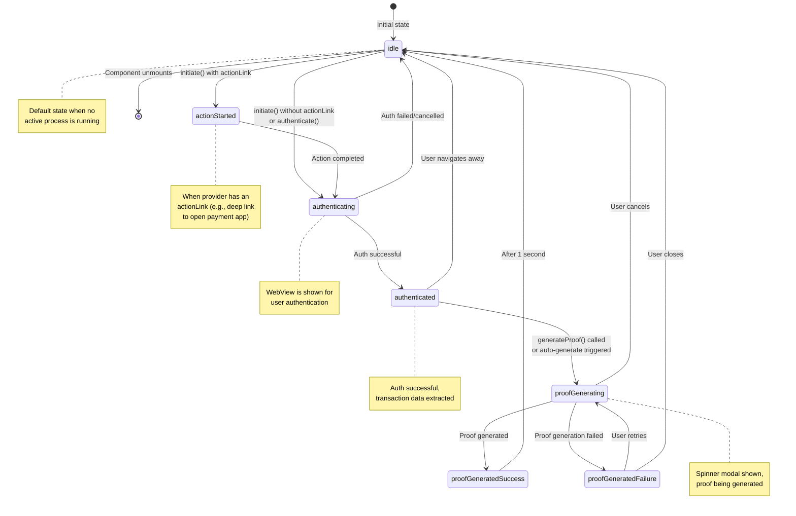

# FlowState State Machine Diagram

## Overview
The `flowState` represents the current state of the authentication and proof generation flow in the zkp2p SDK.

## State Machine Diagram

## State Transitions Table

| From State | To State | Trigger | Description |
|------------|----------|---------|-------------|
| `idle` | `actionStarted` | `initiate()` with actionLink | Initial action required before auth |
| `idle` | `authenticating` | `initiate()` without actionLink or `authenticate()` | Direct authentication |
| `actionStarted` | `authenticating` | Action completion | User completes initial action |
| `authenticating` | `authenticated` | Successful auth | Auth WebView intercepted valid response |
| `authenticating` | `idle` | Auth failure/cancel | User cancels or auth fails |
| `authenticated` | `proofGenerating` | `generateProof()` or auto-generate | Proof generation starts |
| `authenticated` | `idle` | User navigation | User goes back without generating proof |
| `proofGenerating` | `proofGeneratedSuccess` | Proof success | Proof generated successfully |
| `proofGenerating` | `proofGeneratedFailure` | Proof error | Proof generation failed |
| `proofGenerating` | `idle` | User cancels | User presses exit button |
| `proofGeneratedSuccess` | `idle` | Timer (1s) | Automatic transition after success |
| `proofGeneratedFailure` | `proofGenerating` | User retry | User clicks retry button |
| `proofGeneratedFailure` | `idle` | User closes | User clicks close button |
